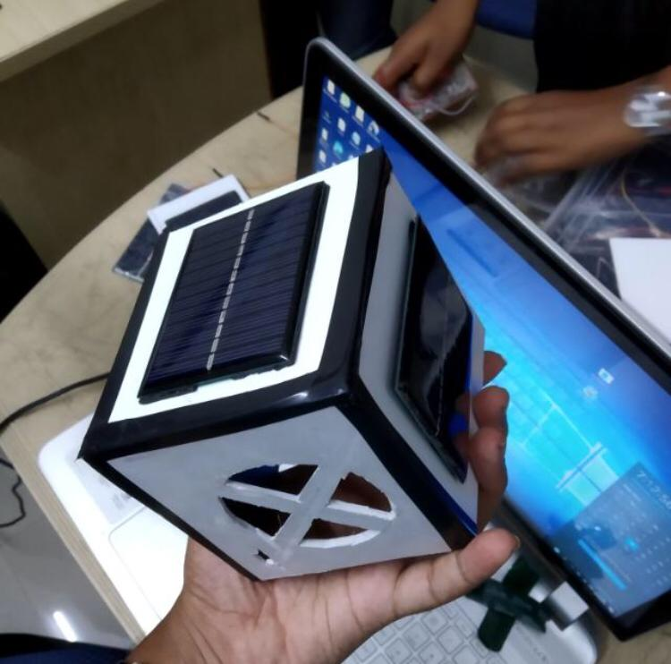

# CUBESAT USING ARDUINIO 
 

A Picosatellite is made using arduino development board with a open source architecture. 

## Getting Started

The core components of the picosatellite are  chassis, Micro Controller Unit, Sensors. We will design and fabricate the cubesat chassis using 3D printer technology. To recieve and detect various data from IMU sensors. Work has been made for this project to get data from the sensors using Arduino IDE and python is used to visualize, plot live data graph and to store data.

### Prerequisites

The prerequsites are given below
```
*Python IDE - pycharm, wing pro 6/7
*Arduino IDE 
*Fritizing (Not Mandatory)
```
### Installing

* Install any Python IDE - [PyCharm](https://www.jetbrains.com/pycharm/) 
* Install Arduino IDE - [Arduino IDE](https://www.arduino.cc/en/main/software)

### Arduino libraries 

* [DHT sensor library]( https://github.com/adafruit/DHT-sensor-library)
* SD library
* SPI library
* RadioHead
* MPU6050

### Python libraries 

 * pygame
 * pyserial
 * opengl
 * matplotlib
 
 ### Deployment 
  1. Connect the circuit for MPU-6050 and dht11 seperately
  2. Connect the Arduino with Laptop/PC
  3. Download or install all the required libraries for python and arduino
  4. Make sure you choose the correct port and board in Arduino IDE 
  5. Upload the ``IMU_Cubesat.ino`` to the Arduino IDE
  (NOTE:- You dont need to upload the sketches to Arduino board every single time)
  6. open the ``main.py`` in any python IDE
  7. Go to line 10 and modify ``YOUR_PORT_NO`` to the one you selected in arduino IDE
  
```
  ser = serial.Serial('YOUR_PORT_NO', 38400, timeout=1)
  ser = serial.Serial('COM7', 38400, timeout=1)
 ```
 
 

 
 
